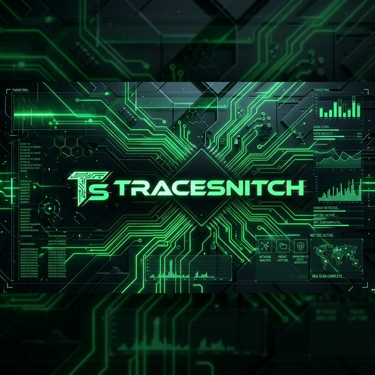

# 🛡️ Trace-Snitch Intelligence Systems



> **Precision Beyond Perception.** A high-performance, AI-driven PCB inspection and tracing ecosystem built for modern industrial surveillance.

[](https://vercel.com)
[](https://reactjs.org/)
[](https://vitejs.dev/)

---

## ⚡ Core Capabilities

Trace-Snitch is not just a dashboard; it's a complete protocol for hardware integrity.

*   **🔍 High-Precision Scanning**: Real-time PCB anomaly detection using neural-trace algorithms.
*   **📹 Multi-Node Monitoring**: Synchronized live feeds from up to 4 logic-critical camera arrays.
*   **🛡️ Secure-Auth Protocol**: Multi-step identity verification including JWT-S key exchange and MFA.
*   **📊 Statistical Overlook**: Comprehensive data visualization of failure trends and production velocity.
*   **📜 Neural Documentation**: Deep-integrated API guides and hardware handshake protocols.

---

## 🚀 Deployment

Trace-Snitch is optimized for Vercel deployment.

### Quick Start
```bash
# Clone the repository
git clone https://github.com/Arnazz10/TraceSnitch.git

# Install dependencies
npm install

# Start the intelligence engine
npm run dev
```

### Production Build
```bash
npm run build
```

---

## 🛠 Tech Stack

- **Frontend**: React 18 (Vite)
- **Styling**: Premium Glassmorphism (Vanilla CSS)
- **Icons**: Lucide React
- **Branding**: Custom Neural-Trace Aesthetic
- **Deployment**: Vercel Edge

---

## 🔗 Navigation

- **[Dashboard](/dashboard)**: Statistical KPIs and Anomaly Distribution.
- **[Live Monitor](/monitor)**: The Core-01 Scan-Processing Engine.
- **[Documentation](/docs)**: API and Hardware Handshake technical guides.
- **[Configuration](/config)**: Camera and Detection Model optimization.

---

## 📜 Legal & Security

Encrypted Connection Active. User access is subject to the **Hardware Access Agreement**. Trace-Snitch is an Open Source Core project.

© 2024 Trace-Snitch Intelligence Systems.
